## Wayfarer Planner, an IITC plugin to help you nominate your candidates

Let's say that you already have the map of Pokestops and Gyms, (or just Portals if you're only an Ingress player), something like this using [Pogo Tools](https://github.com/AlfonsoML-s/pogo-s2):
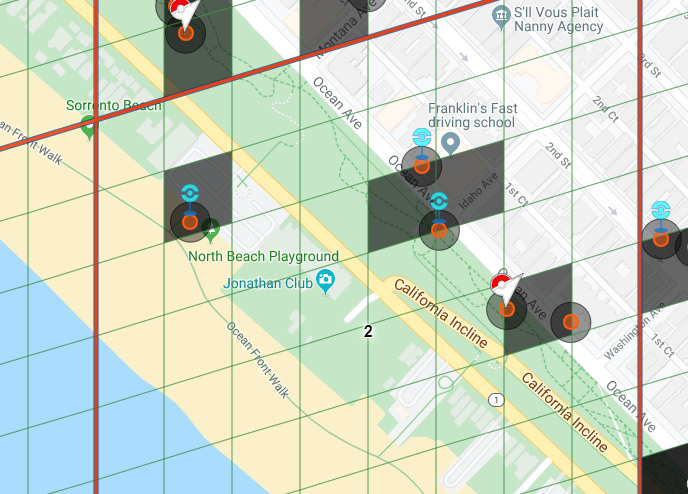

And now you want to better plan where to submit your candidates so they are at least 20 m. away from existing portals, if possible don't share the same Level 17 cell as other existing portals, even track possible edit requests to put things in their proper locations. Something like this, 
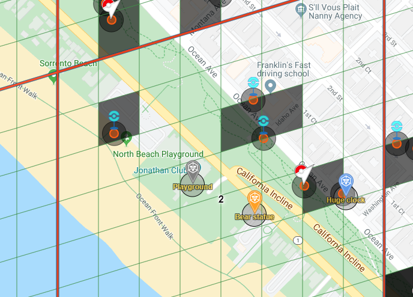
You could do it using Draw tools, but it's not as easy as clicking on the map, and fill any additional info to remember later what this was about
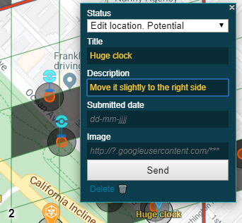

and also this allows you to easily share your data between different devices, and even share plans with other teammates to avoid sending the same candidate twice, as it's stored in a Google Sheet

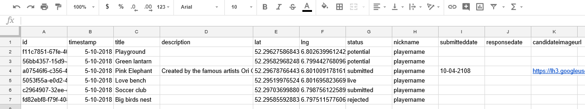

It's easy to use, but it requires a bit of configuration if you want to create your own google sheet. However, when you've completed the setup, it is a matter of installing the userscript and you are good to go.

## A. Install the plugin for IITC 
If you want to make use of an existing sheet. Install the [userscript](https://github.com/AlfonsoML-s/wayfarer-tools/raw/master/wayfarer-planner.user.js), load IITC and enter the scripturl.

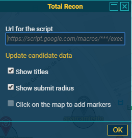

You can test it out with this script url

Test script url: https://script.google.com/macros/s/AKfycbyBx4dR0s8v1ZEsnuKFARfmibHiqTY20qO0EU3vRML4y4XW6wmu/exec

Keep in mind that this a shared sheet, after checking that the plugin works as expected you must use your own sheet instead of this one. 
If you're using any extension that blocks Google domains like Privacy Badger you'll have to unblock it for this domain.

List of functions is at the end of this page

## B. If you want to create your own sheet, you should follow these instructions:

 1. Go to: https://docs.google.com/spreadsheets/u/0/
 2. Start a new, blank, spreadsheet 
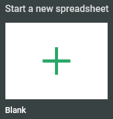

 3. Go to ‘Tools’ -> ‘Script editor’ 
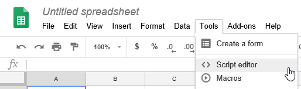

 4. Remove content in Code.gs and paste the content from this [Code.gs](Code.gs) file and click the Save Button 
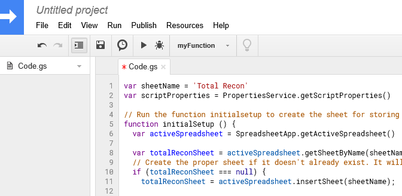

 5. Select the ‘initialSetup’ function 
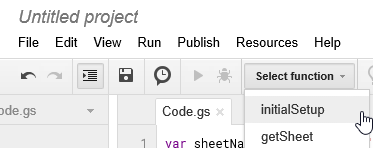

 6. Click the ‘play’ button to run 
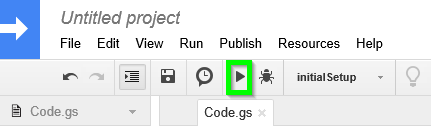

 7. A dialogue pops up, choose ‘review permissions’ 
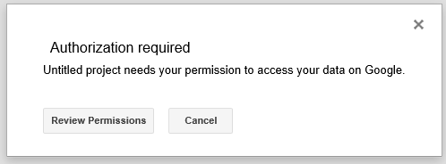

 8. Choose the appropriate google account 
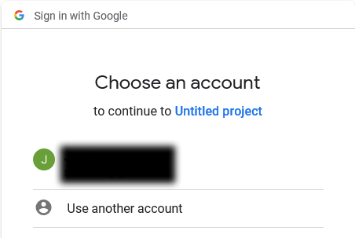

 9. Choose advanced 
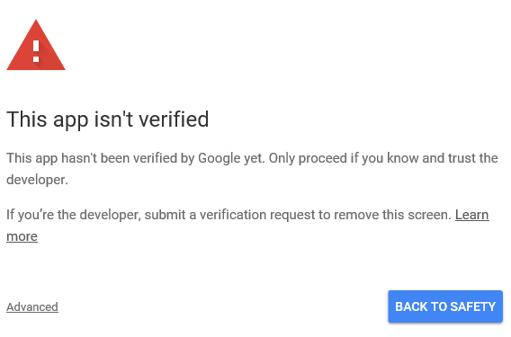

 10. Go to ‘Untitled project’ 
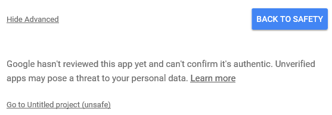

 11. Choose your Google+ account and ‘Allow’ 
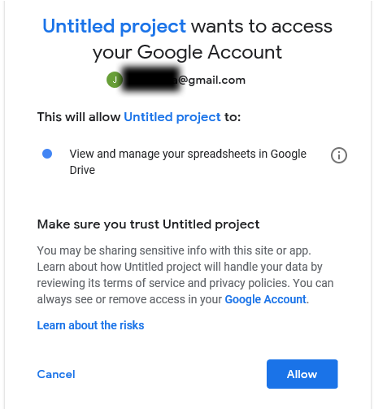

 12. The initialsetup will be run and the sheet will be prepared with the proper columns and column settings 
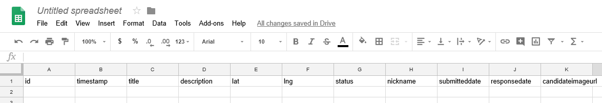

 13. Go back to script and choose ‘Publish’->’Deploy as WebApp’ 
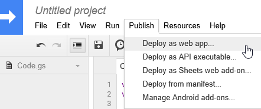

 14. Set ‘Who has access to the app” to Anyone even anonymous. 
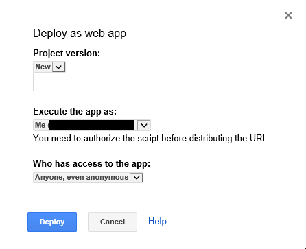

 15. And choose ‘Deploy’ 
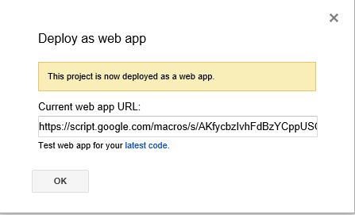

 16. Copy the ‘Current web app URL’. You will be needing it later on. 

 17. Install the [userscript](https://github.com/AlfonsoML-s/wayfarer-tools/raw/master/wayfarer-planner.user.js). On first launch you will be prompted to enter this URL. 

If you're using any extension that blocks Google domains like Privacy Badger you'll have to unblock it for this domain. 

You will need to share this URL with all people and/or devices who will share the same set of data.

## How to update the code.gs script
If for some reason there's a need to update the script in code.gs, follow these steps
1. Replace the existing code with the new one of code.gs  
2. Follow from step 13 above: Publish -> Deploy as WebApp.  
3. In the dialog of step 14, mark it as **New** Project version.   
4. Click deploy and when you get the dialog of step 15 you're done.  

## List of functions
A new link "Wayfarer" is added in the sidebar, you can click it to open the settings dialog. 
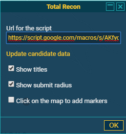
When you enable the "Click on the map to add markers" checkbox, then you can click on the map to add new markers 
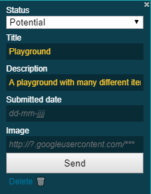

You will see that all input and changes will be stored in your google sheet. You can share the sheet with whomever you like, or keep it to yourself. Removing markers is a matter of removing a row from the sheet. 

You can toggle several layers on and off in the layer menu. 
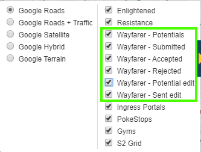

To refresh the markerset you can use the "Update candidate data" link in the dialog.

You can track both candidates for new locations as well as edit request to adjust the location of existing portals.

## Integration with Wayfarer
You can use an additional plugin for TamperMonkey to automatically manage your data using the nominations tracked in Wayfarer:
Read how to use it: [Wayfarer Exporter](exporter.md)

## Differences from the original TotalRecon
This plugin started as a fork of https://github.com/Wintervorst/iitc/raw/master/plugins/totalrecon/  

I suggested to provide patches to the original version in order to fix some issues and improvements, but the offer was declined and told to create my own fork, so here it is.  
1. Removed some unused code from previous plugins and fix errors like one that happened when a layer is enabled/disabled.  
2. Don't use highlighters, instead provide a dialog with an option to enable the addition of new markers.  
3. The dialog allows to update the URL and refresh when required.  
4. Add options to track also Edit requests.
5. Allow to remove candidates from the map.  
6. Layout improvements to the edit dialog.
7. Anything that comes after renaming it to "Wayfarer planner." https://github.com/AlfonsoML-s/wayfarer-tools/commits/master
